# Cloudgate Hotel Demo

An Angular hotel discovery demo app for the [Cloudgate](https://cloudgate.dev) **Web Coder** Quick Start gallery. It ships with a mobile-style hospitality experience, Cloudgate branding, and the hosted **IdP user login flow** used across Cloudgate app templates.

Browse featured stays, favourites, and explore listings backed by a Cloudgate workflow.

**Public demo:** [https://hotel-demo.cloudweb.dev/](https://hotel-demo.cloudweb.dev/)

## Screenshots

Mobile UI in light and dark mode. Full-size files live in [`docs/screenshots/`](./docs/screenshots/).

### Light mode

<p align="center">
  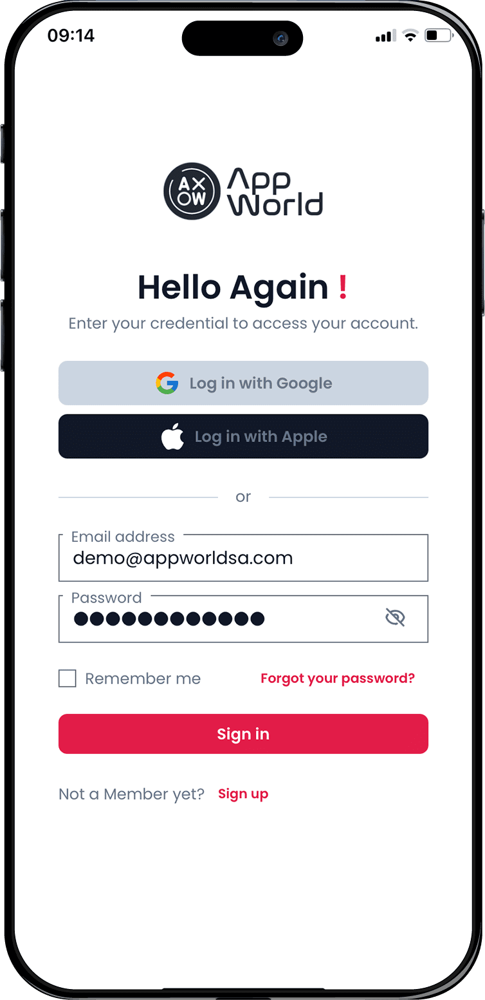
  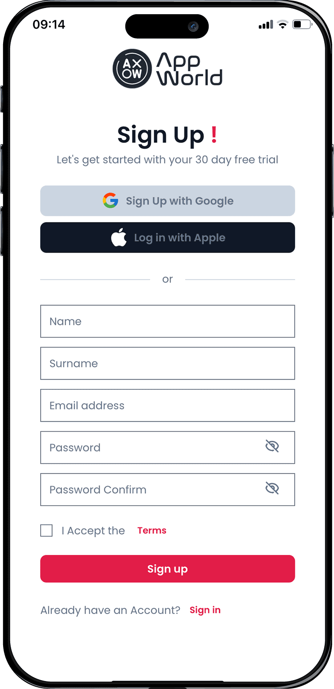
  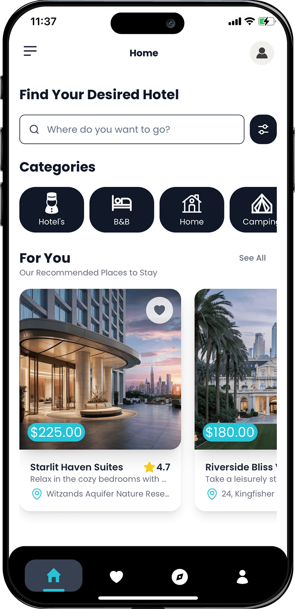
  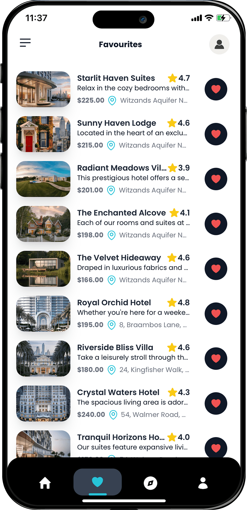
</p>
<p align="center"><sub>Sign in · Sign up · Home · Favourites</sub></p>

<p align="center">
  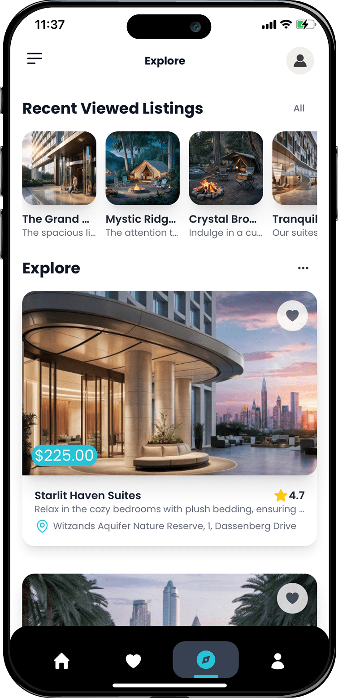
  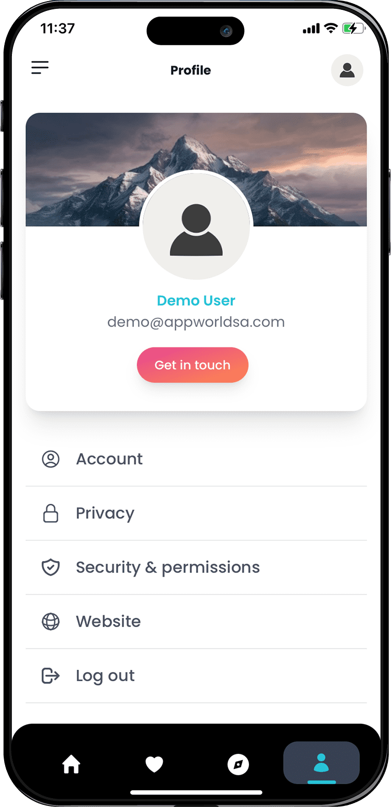
  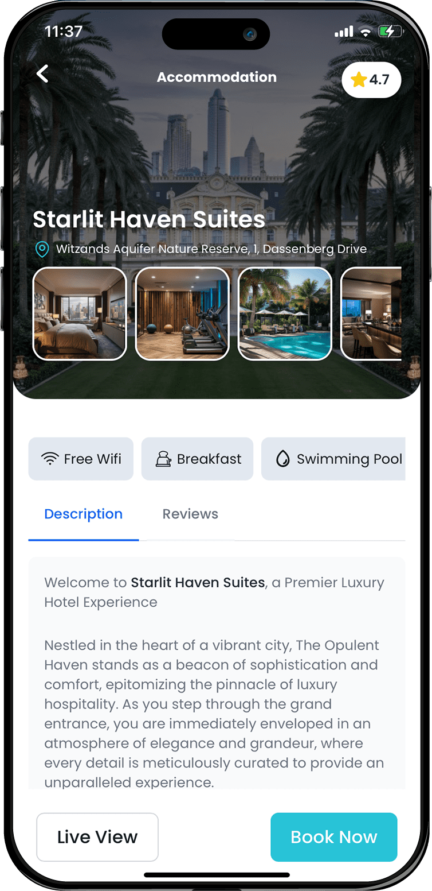
  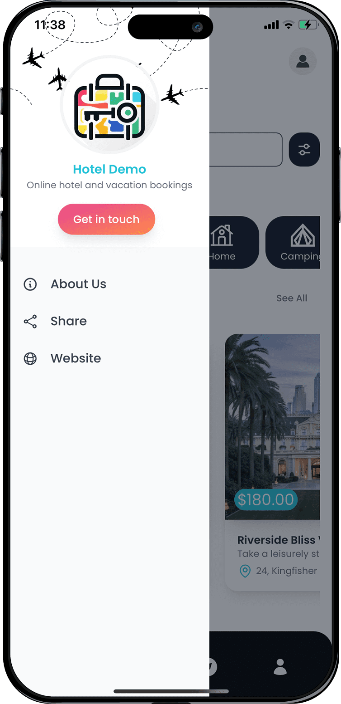
</p>
<p align="center"><sub>Explore · Profile · Place detail · Side menu</sub></p>

### Dark mode

<p align="center">
  
  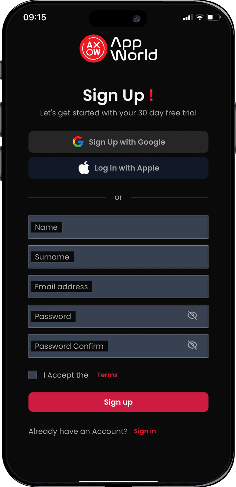
  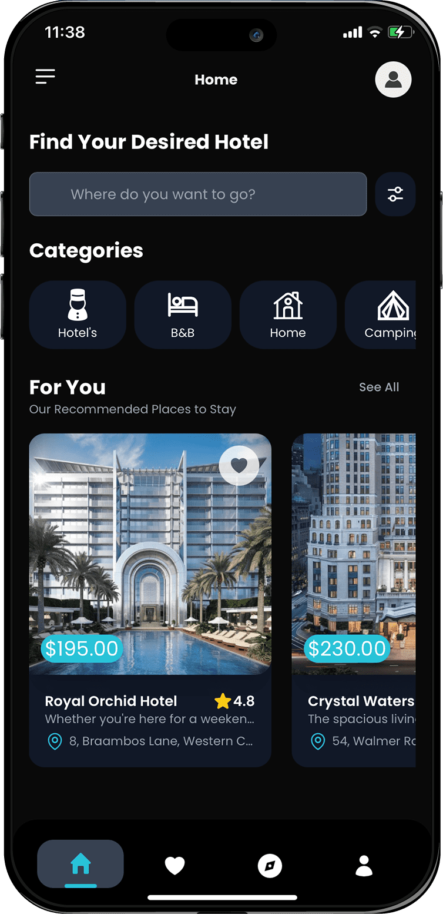
  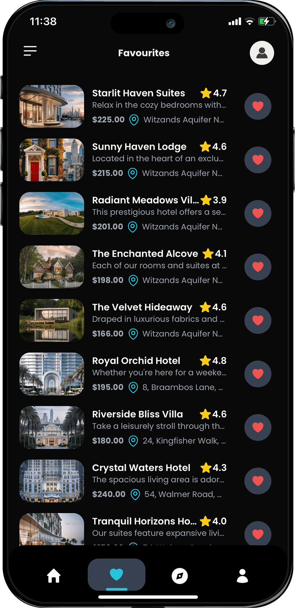
</p>
<p align="center"><sub>Sign in · Sign up · Home · Favourites</sub></p>

<p align="center">
  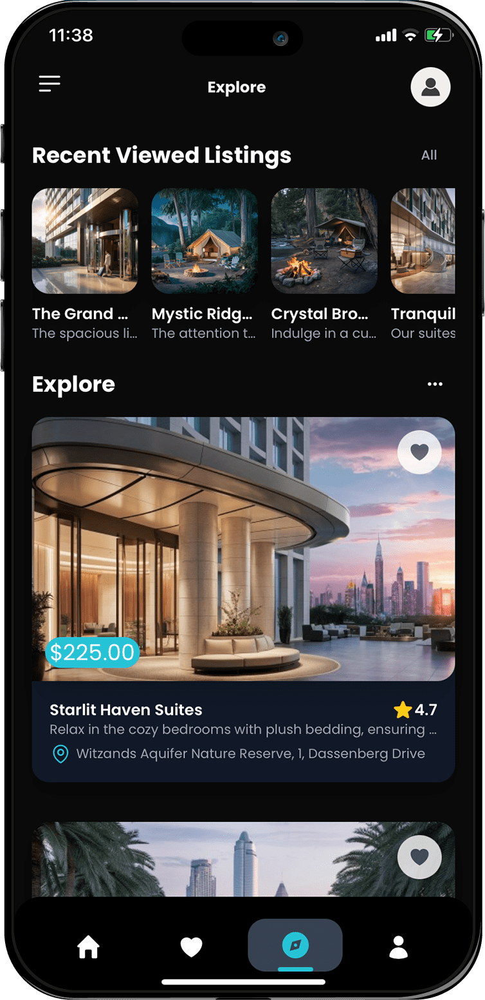
  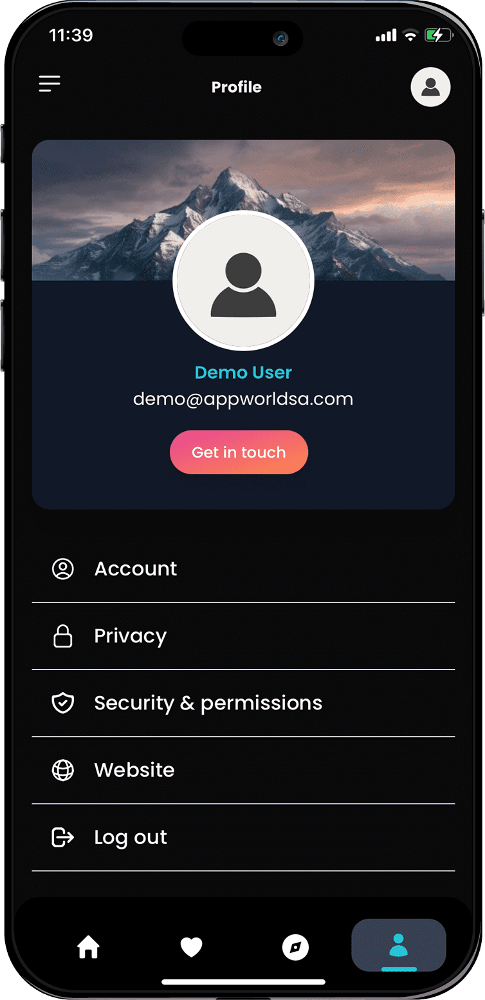
  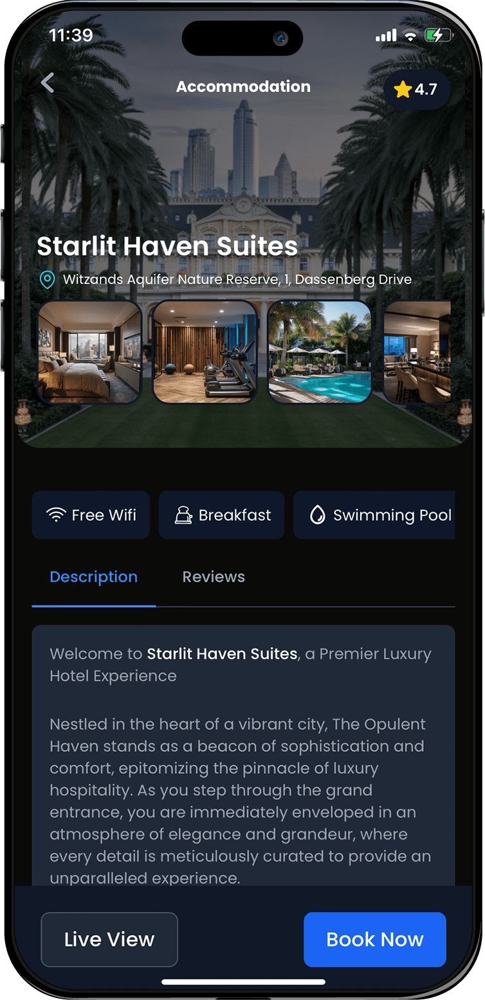
  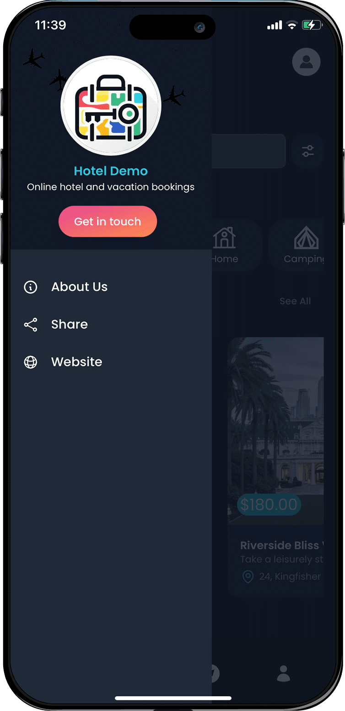
</p>
<p align="center"><sub>Explore · Profile · Place detail · Side menu</sub></p>

## Stack

- **Angular 17** (standalone components)
- **Tailwind CSS 3**
- **Capacitor 6** (optional native builds)
- **Flowbite** UI primitives
- **IdP auth** (same pattern as the `booking` and `podcast` templates in this repo)

## Features

- Home feed with categories and “For You” recommendations
- Favourites and Explore views backed by a Cloudgate workflow (`GET /hotels`)
- Place detail with room gallery
- Profile page with account edit, privacy, terms, and sign-out
- Hosted IdP sign-in (redirect — no embedded login form)
- Cloudgate branding assets under `src/assets/branding/`

## Configuration

Edit `src/assets/appconfig.json` for local development:

```json
{
  "appBaseUrl": "http://localhost:3000",
  "idpBaseUrl": "http://localhost:5173",
  "idpApiUrl": "http://apps.localhost:44301",
  "idpTenancyName": "apps",
  "workflowGatewayUrl": "http://apps.localhost:44301",
  "environment": "sbx"
}
```

## Workflow

Import [`.template/workflow-template.json`](.template/workflow-template.json) in Cloudgate, publish the **Hotel Catalog** endpoint to sandbox, then confirm:

`GET http://apps.localhost:44301/sbx/api/hotels`

## Local development

```bash
npm install
npm run start
```

Serves on port **3000** with `proxy.conf.json` for the workflow gateway.

## Build

```bash
npm run build
npm run serve
```
