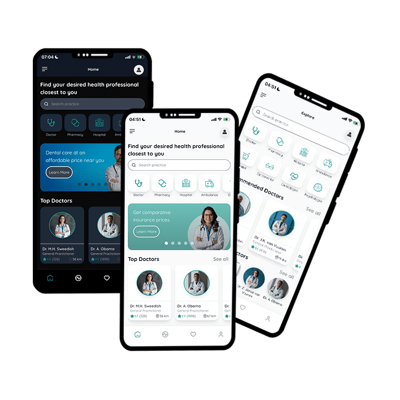

# Cloudgate Medical Demo

An Angular medical discovery demo app for the [Cloudgate](https://cloudgate.dev) **Web Coder** Quick Start gallery. Browse doctors, book appointments, and explore healthcare providers backed by a Cloudgate workflow.

**Public demo:** [https://medical-demo.cloudweb.dev/](https://medical-demo.cloudweb.dev/)

## Screenshots

<p align="center">
  
</p>

Mobile UI in light and dark mode. See the [live demo](https://medical-demo.cloudweb.dev/) for the full experience.

## Stack

- **Angular 17** (standalone components)
- **Tailwind CSS 3**
- **Capacitor 6** (optional native builds)
- **IdP auth** (Cloudgate user login flow)
- **Workflow catalog** (`GET /doctors`)

## Features

- Home feed with categories and Top Doctors carousel
- Doctor appointment detail (`/home/doctor`)
- Favourites and Explore views backed by workflow
- Profile and profile edit
- Mobile-only shell on desktop (430px phone frame)

## Local development

```bash
npm install
npm run start:local
```

The app runs on **port 3000** with `proxy.conf.json` forwarding IdP and workflow requests.

## Configuration

Edit `src/assets/appconfig.json`:

| Key | Purpose |
|-----|---------|
| `idpUrl` | Cloudgate IdP base URL |
| `workflowGatewayUrl` | Apps gateway for workflow APIs |
| `workflowEnvironment` | `sbx` or `prod` |
| `medicalCatalogRoute` | Catalog route segment (`doctors`) |

## Workflow import

1. Import `.template/workflow-template.json` into your Cloudgate workflow project.
2. Publish the **Doctor Catalog** endpoint to sandbox.
3. Verify `GET /sbx/api/doctors` returns the sample catalog JSON.

See `template.json` for gallery metadata and import hints.
