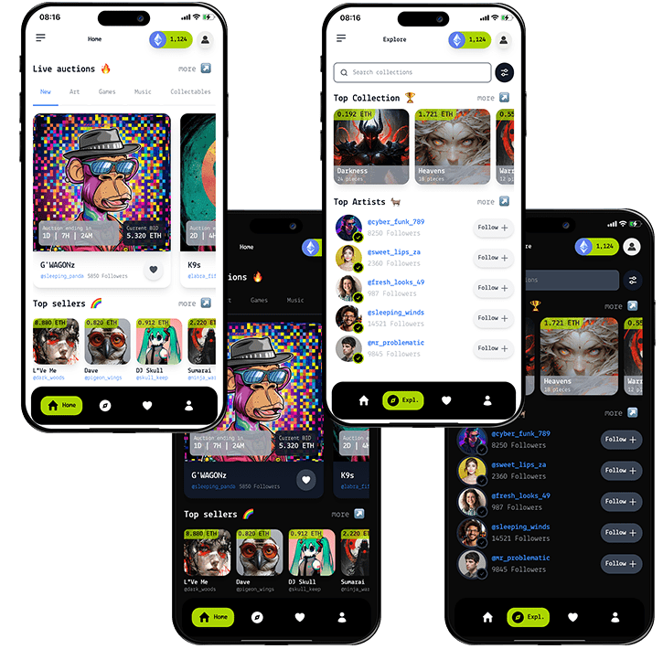

# Cloudgate NFT Demo

Angular NFT auction demo for the [Cloudgate](https://cloudgate.dev) **Web Coder** gallery. Browse NFT collections, place bids, and explore listings backed by a Cloudgate workflow (`GET /nfts`).

**Public demo:** [https://nft-demo.cloudweb.dev/](https://nft-demo.cloudweb.dev/)

## Screenshots

<p align="center">
  
</p>

Mobile UI in light and dark mode. See the [live demo](https://nft-demo.cloudweb.dev/) for the full experience.

## Local development

```bash
npm install
npm run start:local
```

Runs on **port 3000** with IdP and workflow proxying via `proxy.conf.json`.

## Workflow import

Import `.template/workflow-template.json`, publish the **NFT Catalog** endpoint, and verify `GET /sbx/api/nfts`.
