# Cloudgate Podcast Demo

An Angular podcast demo app for the [Cloudgate](https://cloudgate.dev) **Web Coder** Quick Start gallery. It ships with a full mobile-style listening experience, Cloudgate branding, and the hosted **IdP user login flow** used across Cloudgate app templates.

Use it as a starting point when you want more than a blank shell — browse categories, manage playlists, view history, play episodes, and edit a user profile — while still fitting into the Cloudgate editor preview workflow.

**Public demo:** [https://placeholder.cloudgate.dev](https://placeholder.cloudgate.dev)

## Screenshots

Mobile UI in light and dark mode. Full-size files live in [`docs/screenshots/`](./docs/screenshots/).

### Light mode

<p align="center">
  
  
  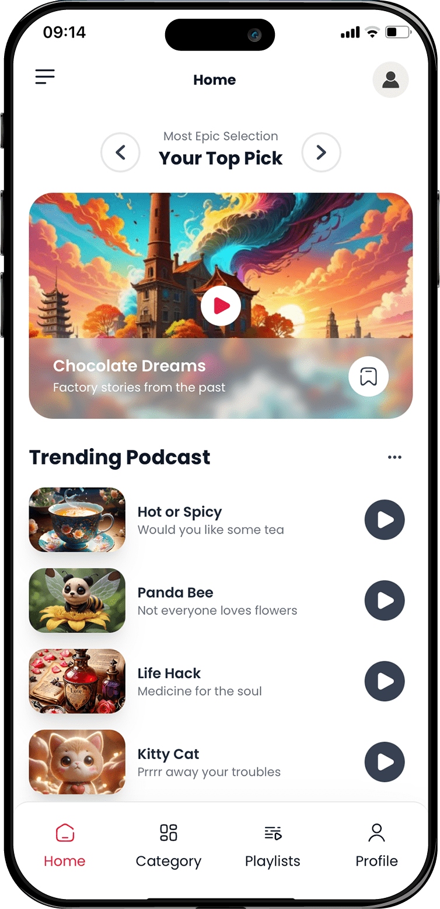
  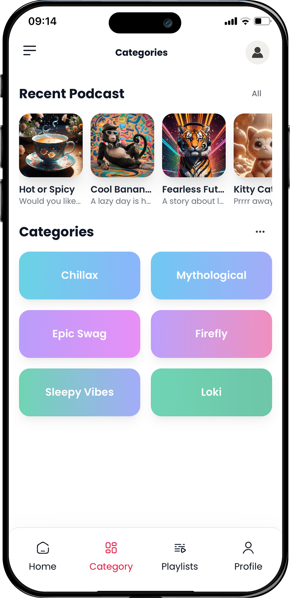
</p>
<p align="center"><sub>Sign in · Sign up · Home · Categories</sub></p>

<p align="center">
  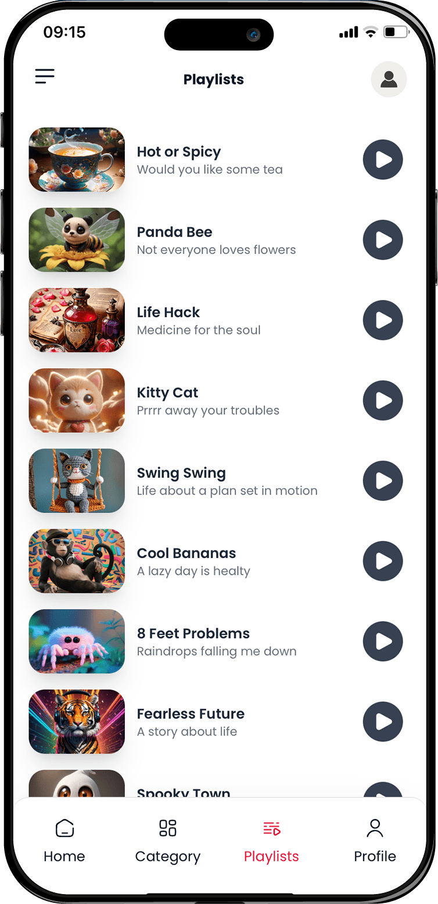
  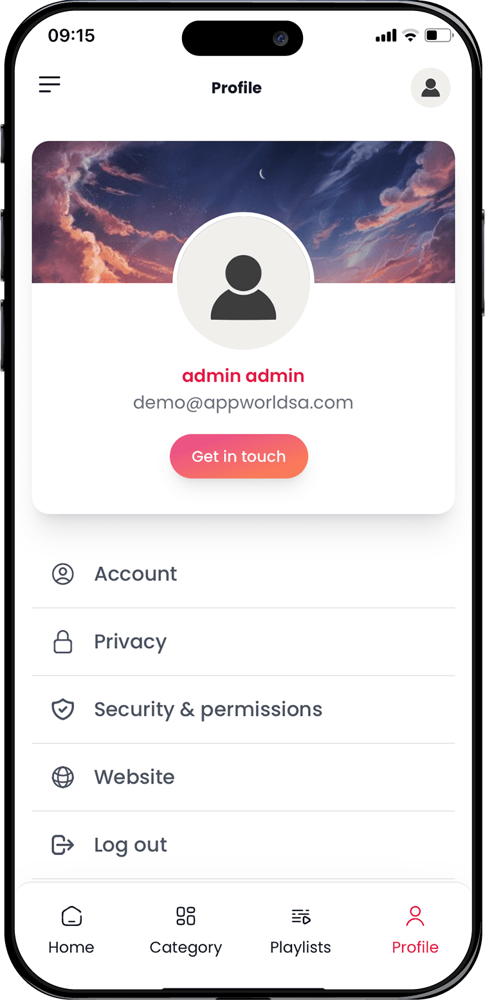
  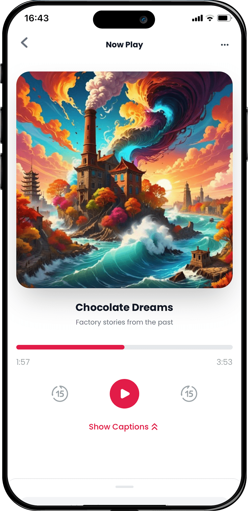
  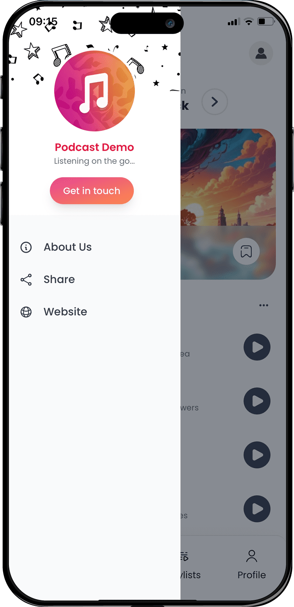
</p>
<p align="center"><sub>Playlists · Profile · Now playing · Side menu</sub></p>

### Dark mode

<p align="center">
  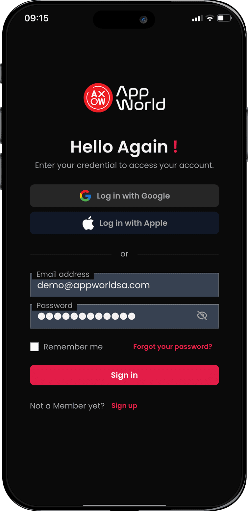
  
  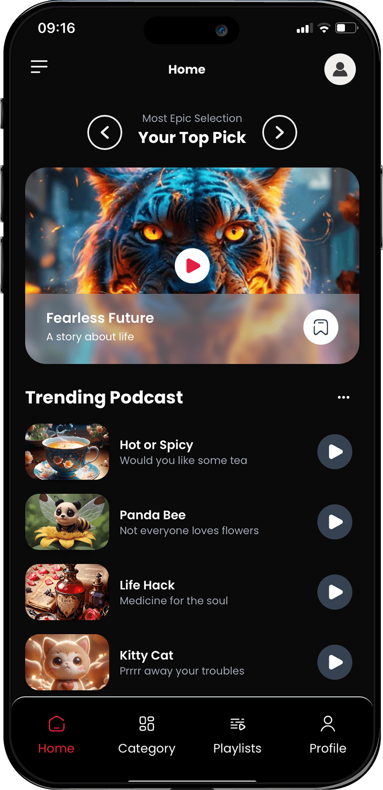
  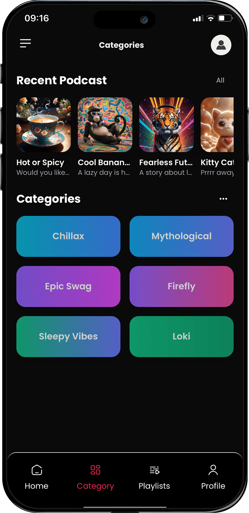
</p>
<p align="center"><sub>Sign in · Sign up · Home · Categories</sub></p>

<p align="center">
  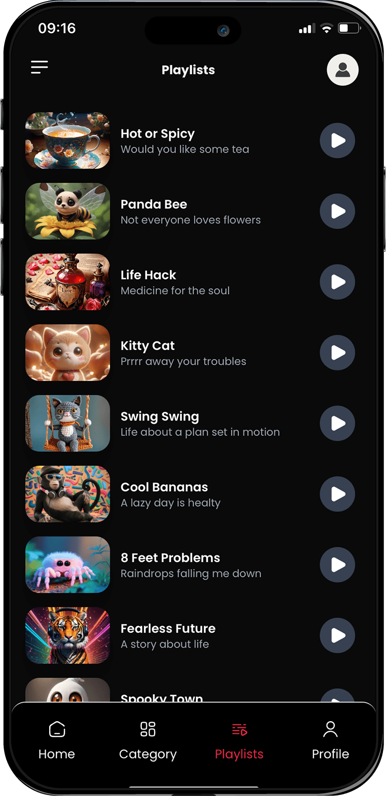
  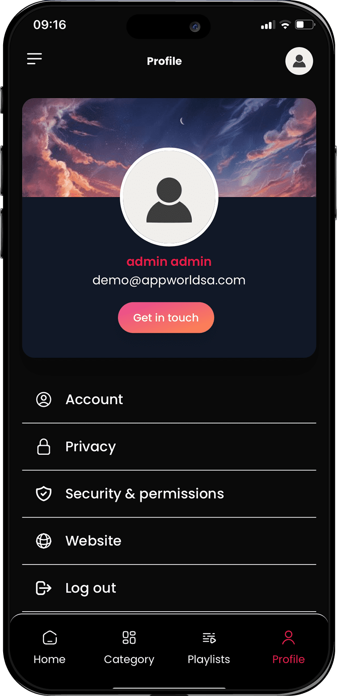
  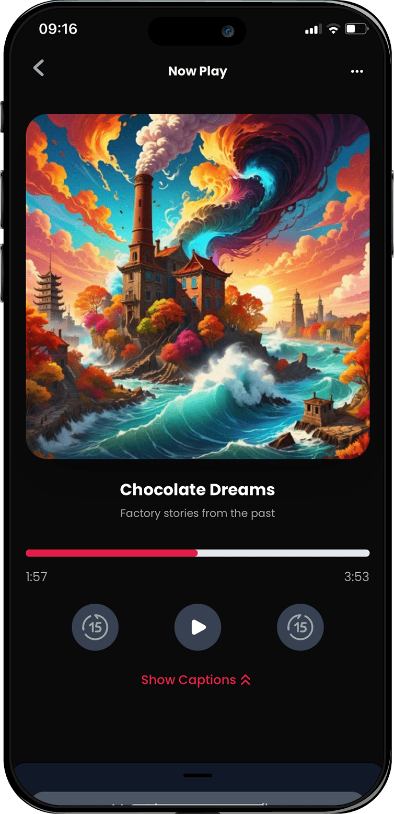
  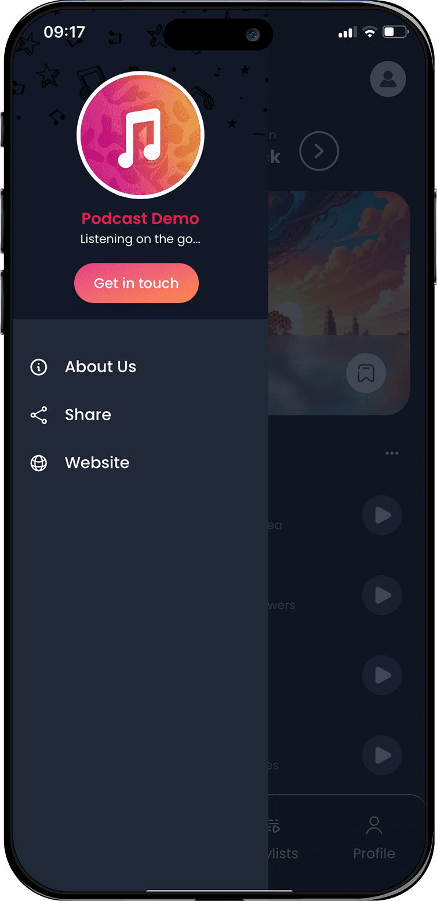
</p>
<p align="center"><sub>Playlists · Profile · Now playing · Side menu</sub></p>

## Stack

- **Angular 17** (standalone components)
- **Tailwind CSS 3**
- **Capacitor 6** (optional native builds)
- **Flowbite** UI primitives
- **IdP auth** (same pattern as the `angular` and `react` templates in this repo)

## Features

- Podcast home, categories, playlists, history, and now-playing views
- Profile page with account edit, privacy, terms, and sign-out
- Hosted IdP sign-in (redirect — no embedded login form)
- Cloudgate branding assets under `src/assets/branding/`
- Dark theme and a mobile app frame on desktop viewports
- Lazy-loaded feature modules and route guards

## Login flow

1. An unauthenticated visitor is redirected by `AppRouteGuard` to `/auth/sign-in`.
2. `SignInComponent` sends the user to the hosted IdP login page:
   `{idpBaseUrl}/idp/{tenancy}/login`.
3. After authenticating, the IdP redirects back with
   `?access_token=...&refresh_token=...&expires_in=...`.
4. `idp-auth.bootstrap` validates the token, stores it, strips query params, and loads the session.
5. Token refresh and logout use the same IdP endpoints as other Cloudgate templates.

## Configuration

Edit `src/assets/appconfig.json` for local development:

| Key | Description |
| --- | --- |
| `remoteServiceBaseUrl` | Cloudgate API base URL (e.g. `http://localhost:44301`). |
| `appBaseUrl` | App URL pattern with tenancy placeholder (e.g. `http://{TENANCY_NAME}.localhost:3000`). |
| `idpBaseUrl` | Base URL of the IdP (used to build the hosted login URL). |
| `idpApiUrl` | Optional separate API base for profile/refresh. Falls back to `remoteServiceBaseUrl`. |
| `idpTenancyName` | Default tenancy name. Override at runtime with `?idp_tenant=` or a tenant subdomain. |
| `idpReturnUrl` | Optional post-login redirect. Defaults to the current app URL. |
| `workflowGatewayUrl` | Cloudgate apps gateway (e.g. `http://apps.localhost:44301`). |
| `workflowEnvironment` | `sbx` or `prod` — which published workflow slot to call. |
| `workflowProjectPath` | Project path segment (default `api`). |
| `podcastCatalogRoute` | Workflow route for catalog JSON (default `podcasts`). |

## Workflow data

Home, Categories, Playlists, and Now Playing load podcast content from a Cloudgate workflow instead of hard-coded template HTML.

**Runtime URL:** `{workflowGatewayUrl}/{workflowEnvironment}/{workflowProjectPath}/{podcastCatalogRoute}`

Example: `http://apps.localhost:44301/sbx/api/podcasts`

### Create the workflow

**Quick Start (recommended):** use the **Cloudgate Podcast Demo** template from Web Coder — workflows import automatically when you create the project. Then publish **Podcast Catalog** to sandbox.

**Manual:** upload `.template/workflow-template.json` in Cloudgate Imports → project `api` → publish sandbox.

Quick test after creation:

```powershell
Invoke-WebRequest -Uri "http://apps.localhost:44301/sbx/api/podcasts" -UseBasicParsing
```

### CORS / local dev

The app runs on `{tenant}.localhost:3000` while the gateway is `apps.localhost:44301`. Ensure the gateway allows your app origin, or add a dev proxy in `proxy.conf.json` if needed.

### Angular services

| File | Role |
| --- | --- |
| `src/app/shared/workflow/workflow.config.ts` | Builds workflow URLs from `AppConsts` |
| `src/app/shared/workflow/workflow-http.service.ts` | Generic HTTP client for workflow endpoints |
| `src/app/shared/workflow/podcast-workflow.service.ts` | Loads and caches `PodcastCatalog` |

Runtime links (website, store URLs, sample tenant) live in `src/assets/style.js`:

```js
window.config = {
  Website: 'https://cloudgate.dev',
  iOS: 'https://cloudgate.dev',
  Android: 'https://cloudgate.dev',
  SampleAppTenantId: 5,
  BuildTenantId: undefined,
};
```

Branding paths are centralized in `src/app/shared/branding/app-branding.ts`.

## Scripts

```bash
npm install
npm start        # dev server at http://localhost:3000
npm run build    # production build to dist/
npm run lint     # ESLint
npm run e2e-ui   # Playwright tests (UI mode)
```

| Command | Description |
| --- | --- |
| `npm start` | Starts the dev server on port 3000 |
| `npm run build` | Production build |
| `npm run watch` | Development build with watch |
| `npm run prettier` | Format `src/app` and `src/environments` |
| `npm run serve` | Serve the built `dist/` folder on port 3000 |

## Project structure

```
src/app/
  modules/
    auth/              # Sign-in (IdP redirect) and onboarding
    home/              # Podcast browsing, playback, profile
    layout/            # Shell, navbar, footer
    dashboard/         # Dashboard module (template scaffold)
  shared/
    idp-auth/          # IdP config, bootstrap, profile API, JWT helpers
    branding/          # Cloudgate logo paths
    common/            # AppComponentBase, guards, auth service
src/assets/
  appconfig.json       # API + IdP configuration
  style.js             # Runtime window.config
  branding/            # Cloudgate SVG assets
```

## Web Coder integration

This folder is part of the [cloudgate-app-templates](https://github.com/dev-appworld/cloudgate-app-templates) repo. To publish it in the Web Coder Quick Start gallery:

1. Add a `template.json` in this folder (same shape as `angular/template.json`).
2. Register the template in the root `templates.json` manifest.
3. Point the Cloudgate API `WebApps:TemplatesRepo` setting at the repo (see the root README).

The dev server listens on port **3000**, matching the other Angular template in this repo.

## Local development

Typical local stack:

- **App** — `http://localhost:3000` (or `http://{tenant}.localhost:3000`)
- **API** — `http://localhost:44301`
- **IdP** — `http://localhost:5173`

Ensure `appconfig.json` matches your running services before testing sign-in.

## Capacitor (optional)

This project includes Capacitor for iOS/Android builds. After `npm run build`, use the Capacitor CLI to sync and open native projects. Update `capacitor.config.ts` with your app id and display name before shipping.

## License

Copyright © Cloudgate.dev LLC. See [LICENSE](./LICENSE).
